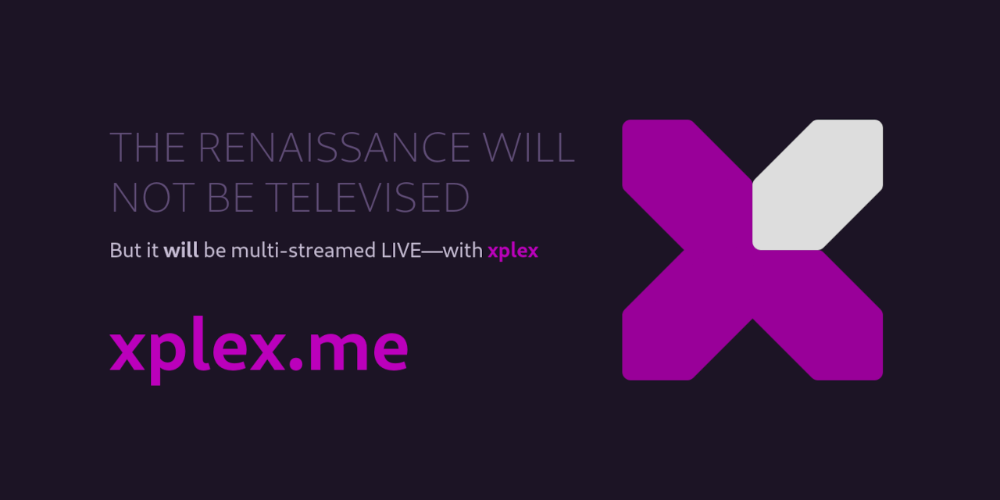

[xplex](https://xplex.me/) —your personal, self-hosted, open source, multi-streaming server


### Links
- [Docs](https://xplex.me/)
- [GitHub](https://github.com/debloper/xplex)
- [Docker Hub](https://hub.docker.com/r/xplex/xplex/)

### TL;DR

#### User
```bash
docker run -d --name xplex -p 80:80 -p 1935:1935 xplex/xplex
```

#### Developer
```bash
git clone https://github.com/debloper/xplex.git
cd xplex

docker build --target xplex -t xplex/xplex:latest .

docker run -d --name xplex -p 80:80 -p 1935:1935 xplex/xplex
```

For more details & next steps... follow the [setup guide](https://xplex.me/setup/).
